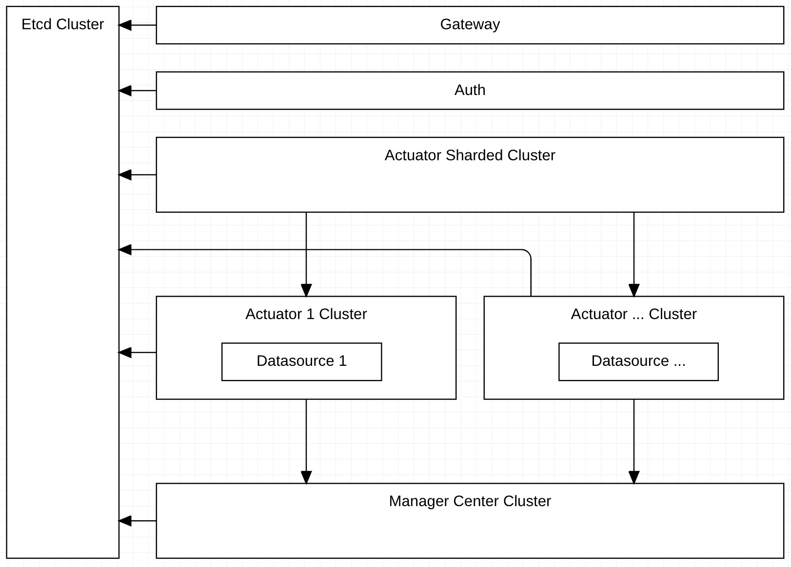

## Architecture

## Introduction

|Component|Use|
|---|---|
|Gateway|Unified access portal of cluster|
|Auth|Safety and certification|
|Etcd Cluster|Data storage and service registry|
|Actuator Shared Cluster|Shared routing of requests and scheduling center of executors|
|Actuator Cluster|Parse http requests to fill in sql and execute sql|
|Manager Center Cluster|Store data source and api information|
