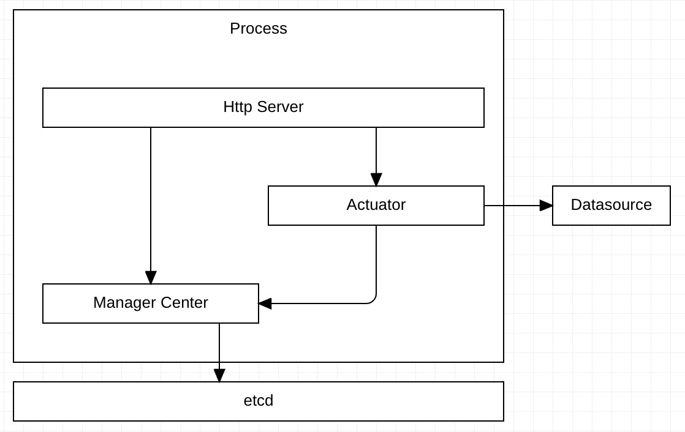

## Architecture


## install etcd by docker-compose
```yaml
version: '2'

services:
  etcd:
    image: docker.io/bitnami/etcd
    ports:
      - 2379:2379
    environment:
      - ALLOW_NONE_AUTHENTICATION=yes
    volumes:
      - etcd_data:/bitnami/etcd
volumes:
  etcd_data:
    driver: local
```
```
docker-compose up -d
```

## install datasource like mysql
```docker
docker run --name mysql -p 3306:3306 -e MYSQL_ROOT_PASSWORD=123456 -d mysql:8.0.32
```
```sql
create database test;

create table tb_tmp01
(
id INT(11),
name VARCHAR(25),
deptId INT(11),
salary FLOAT
);

insert tb_tmp01 values (1, "hello", 1, 200);
```

## download server
```shell
git clone https://github.com/kiraqjx/serverless-dbapi.git
```

## change config.yaml (default)
```yaml
mode: standalone
server:
  port: 8081

actuator:
  databases:
    - id: '1'
      driver-name: mysql
      url: 'root:123456@tcp(localhost:3306)/test?charset=utf8'

manager-center:
  store:
    etcd:
      prefix: '/prod'
      endpoints: 
        - '127.0.0.1:2379'
```

## start standalone server
```shell
cd cmd/actuator

go run main.go
```

## test server
```shell
# add database
curl -X POST -H "Content-Type: application/json" -d '{"id": "5662e9d0-9954-11ed-ac90-e6d8fb3d8925","name": "first","driverName": "mysql","url": "root:123456@tcp(localhost:3306)/test?charset=utf8"}' "http://localhost:8081/manager-center/database"
# remember your database id from response data，my id is 5662e9d0-9954-11ed-ac90-e6d8fb3d8925

# add api group
curl -X POST -H "Content-Type: application/json" -d '{"id": "9a449292-995a-11ed-98d0-e6d8fb3d8925","name": "first"}' "http://localhost:8081/manager-center/api-group"

# remember your api group id from response data, my id is 9a449292-995a-11ed-98d0-e6d8fb3d8925

# add api
curl -X POST -H "Content-Type: application/json" -d '{"id": "e47251d8-995a-11ed-98d0-e6d8fb3d8925","apiGroupId": "9a449292-995a-11ed-98d0-e6d8fb3d8925","apiType": 1,"sql": "select * from tb_tmp01 where id = ? and deptId = ?","paramKey": ["id","deptId"],"dataSourceId": "5662e9d0-9954-11ed-ac90-e6d8fb3d8925"}' "http://localhost:8081/manager-center/api"

# remember your api id from response data, my id is e47251d8-995a-11ed-98d0-e6d8fb3d8925

# actuator this api
curl -X POST -H "Content-Type: application/json" -d '{"id": 1,"deptId": 1}' "http://localhost:8081/actuator/api?apiId=e47251d8-995a-11ed-98d0-e6d8fb3d8925"
```

## desired response

```json
{
    "code": 0,
    "msg": "success",
    "data": [
        {
            "deptId": 1,
            "id": 1,
            "name": "aGVsbG8=",
            "salary": 200
        }
    ]
}
```